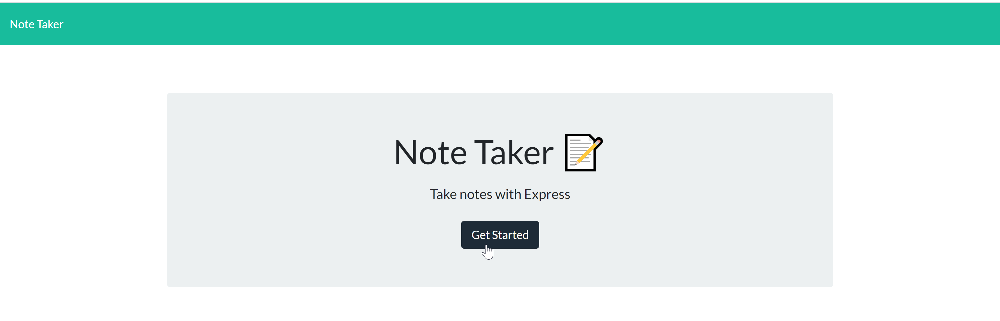
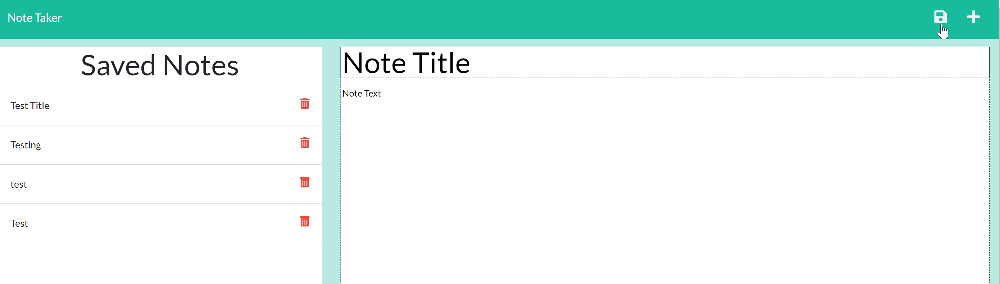
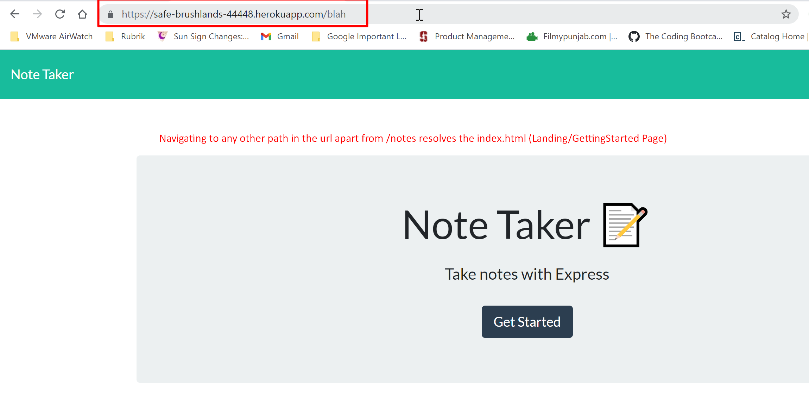
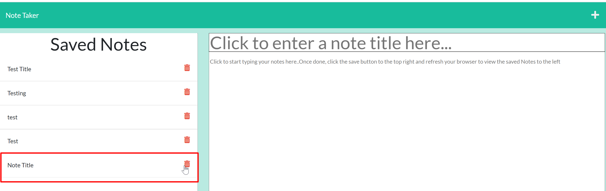
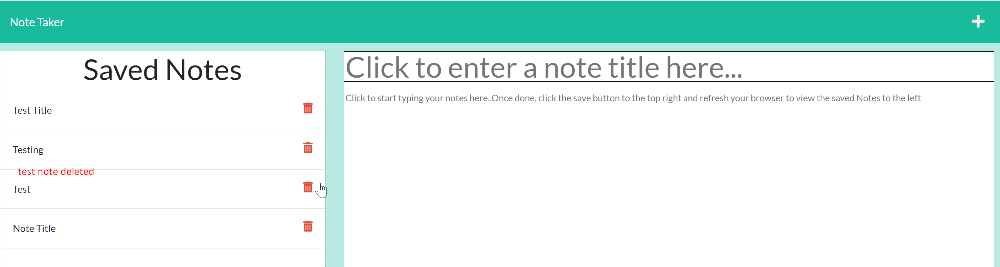
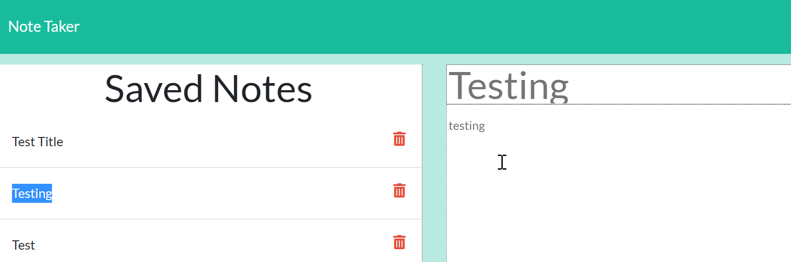
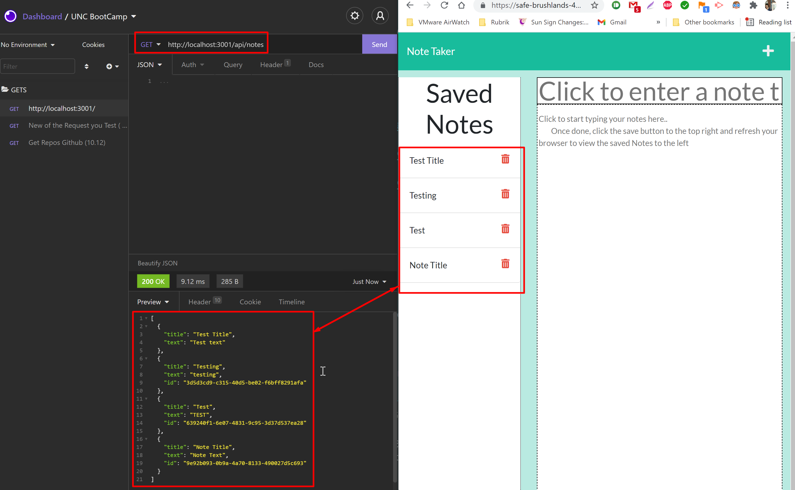
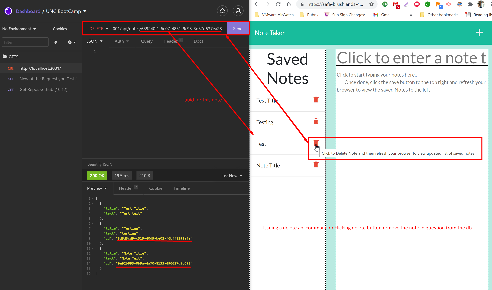
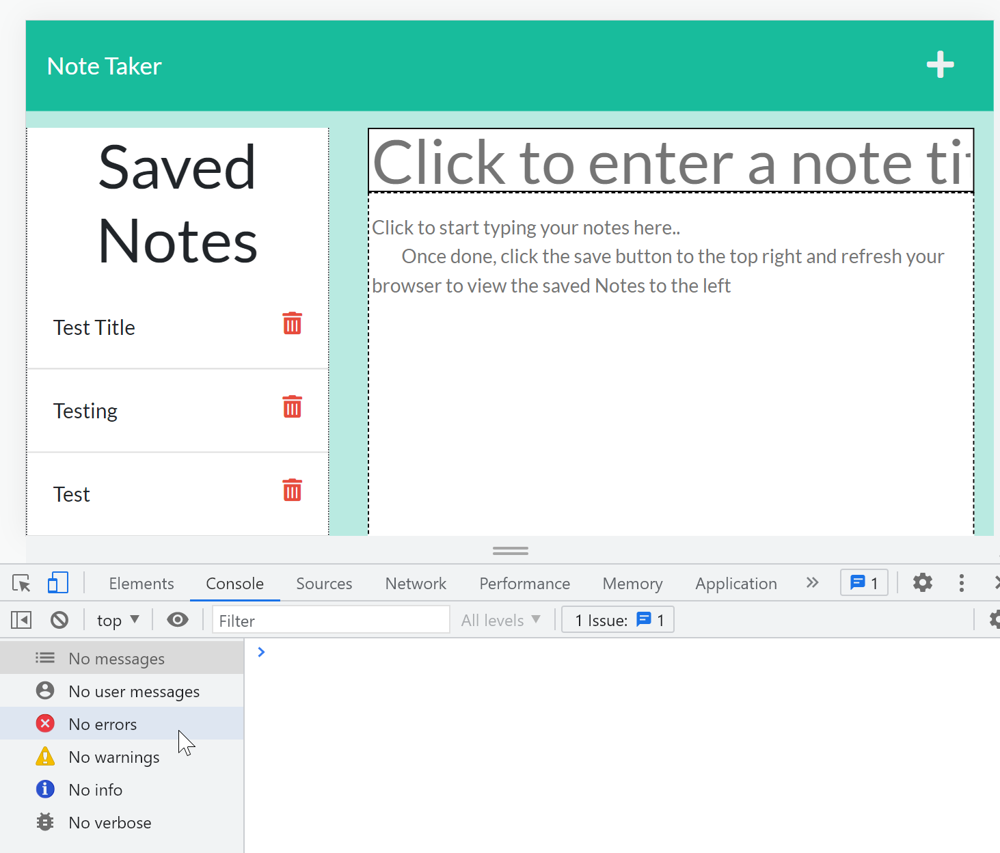

# 11-NoteTaker_Heroku_Express.js-FrontEndandBackEndApp

## Task
Modify starter code to create an application called 'Note Taker' that can be used to write and save notes. This application will use an Express.js back end and will save and retrieve note data from a JSON file.  The application’s front end has already been created. It's our job to build the back end, connect the two, and then deploy the entire application to Heroku.

## DNB's SOLUTION:
#### UNC Boot Camp Submission: 
🗂️ [Github Repository](https://github.com/DionneNoellaBarretto/11-NoteTaker_Heroku_Express.js-FrontEndandBackEndApp)

📰[ReadMe](https://dionnenoellabarretto.github.io/11-NoteTaker_Heroku_Express.js-FrontEndandBackEndApp/)

📑[Heroku Git Repository](https://git.heroku.com/safe-brushlands-44448.git
)

📄 [Example Github Page](https://safe-brushlands-44448.herokuapp.com/)


## User Story

```
AS A small business owner
I WANT to be able to write and save notes
SO THAT I can organize my thoughts and keep track of tasks I need to complete
```

## Acceptance Criteria

```
GIVEN a note-taking application
✓ WHEN I open the Note Taker THEN I am presented with a landing page with a link to a notes page
✓ WHEN I click on the link to the notes page THEN I am presented with a page with existing notes listed in the left-hand column, plus empty fields to enter a new note title and the note’s text in the right-hand column
✓ WHEN I enter a new note title and the note’s text THEN a Save icon appears in the navigation at the top of the page
✓ WHEN I click on the Save icon THEN the new note I have entered is saved and appears in the left-hand column with the other existing notes
✓ WHEN I click on an existing note in the list in the left-hand column THEN that note appears in the right-hand column
✓ WHEN I click on the Add icon in the navigation at the top of the page THEN I am presented with empty fields to enter a new note title and the note’s text in the right-hand column
```

## Application Functionality Screenshots

The following images show the web application's appearance and functionality:
Landing Page/Getting Started Page: 

Notes Page

Rerouting to Landing Page/Getting Started Page no matter which path apart from /notes is entered: 

Note Added

Note Deleted

Saved Notes View

Insomnia Get API Call

Note Deletion using uuid/insomnia

No Console Errors


## Grading Requirements

This homework is graded based on the following criteria: 


### Technical Acceptance Criteria: 40%

* Satisfies all of the preceding acceptance criteria plus the following:
```
  ✅ Application front end must connect to an Express.js back end.
  ✅ Application back end must store notes that have a unique id in a JSON file.
  ✅ Application must be deployed to Heroku.
```

### Deployment: 36%
```
✅ Application deployed at live URL.
✅ Application loads with no errors.
✅ Application GitHub URL submitted.
✅ GitHub repository contains application code.
```

### Application Quality: 11%
```
✅ Application console is free of errors.
```

### Repository Quality: 13%
```
✅ Repository has a unique name.
✅ Repository follows best practices for file structure and naming conventions.
✅ Repository follows best practices for class/id naming conventions, indentation, quality comments, etc.
✅ Repository contains multiple descriptive commit messages.
✅ Repository contains quality README file with description, screenshot, and link to deployed application.
```

### Bonus: +10 Points
```
✅ Application allows users to delete notes.
```

